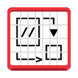

<div align="center">
  
  
  # ASCII Draw
  
  <p align="center">
    <strong>Create beautiful diagrams and artwork using only ASCII characters</strong>
  </p>
  
  <p align="center">
    <a href="https://www.gnu.org/licenses/gpl-3.0">
      
    </a>
    <a href="https://www.python.org/">
      
    </a>
    <a href="https://flathub.org/apps/details/io.github.nokse22.asciidraw">
      
    </a>
  </p>
</div>

---

## ✨ Features

ASCII Draw is a powerful and intuitive application that lets you create stunning diagrams, flowcharts, and artwork using only ASCII characters. Whether you're documenting code, creating technical diagrams, or expressing your creativity, ASCII Draw provides all the tools you need.

<div align="center">
  
</div>

### 🎨 What You Can Create

- **Technical Diagrams**: Flowcharts, network diagrams, system architectures
- **Code Documentation**: Visual representations for README files and documentation
- **Creative Art**: ASCII art and decorative elements
- **Educational Content**: Visual aids for presentations and tutorials

<details>
<summary>📸 <strong>View More Screenshots</strong></summary>

<div align="center">
  
  <br><em>Comprehensive drawing tools and character palette</em><br><br>
  
  
  <br><em>Create complex flowcharts and diagrams</em><br><br>
  
  
  <br><em>Express creativity with ASCII art</em><br><br>
  
  
  <br><em>Clean and intuitive user interface</em><br><br>
  
  
  <br><em>Multiple export and sharing options</em>
</div>

</details>

---

## 🚀 Installation

### 📦 Quick Install

<div align="center">
  <a href='https://flathub.org/apps/io.github.nokse22.asciidraw'>
    
  </a>
  &nbsp;&nbsp;&nbsp;&nbsp;
  <a href="https://snapcraft.io/ascii-draw">
    
  </a>
</div>

### ⚡ From Source

For developers and contributors who want to build from source:

```bash
# Clone the repository
git clone https://github.com/Nokse22/ascii-draw.git

# Navigate to the project directory
cd ascii-draw

# Open in GNOME Builder and click "Run Project"
# Or follow the build instructions in the project documentation
```

---

## 🛠️ System Requirements

- **Operating System**: Linux (GNOME desktop environment recommended)
- **Python**: 3.8 or higher
- **Dependencies**: GTK4, Adwaita

---

## 🤝 Contributing

We welcome contributions! Whether you're fixing bugs, adding features, or improving documentation, your help makes ASCII Draw better for everyone.

### How to Contribute

1. Fork the repository
2. Create your feature branch (`git checkout -b feature/amazing-feature`)
3. Commit your changes (`git commit -m 'Add some amazing feature'`)
4. Push to the branch (`git push origin feature/amazing-feature`)
5. Open a Pull Request

---

## 📄 License

This project is licensed under the GNU General Public License v3.0 - see the [LICENSE](LICENSE) file for details.

---

## 🌟 Support the Project

If you find ASCII Draw useful, please consider:

- ⭐ Starring this repository
- 🐛 Reporting bugs and issues
- 💡 Suggesting new features
- 🔄 Sharing with others who might find it useful

---

<div align="center">
  <p>Made with ❤️ by the ASCII Draw community</p>
  <p>
    <a href="https://github.com/Nokse22/ascii-draw">View on GitHub</a> • 
    <a href="https://github.com/Nokse22/ascii-draw/issues">Report Bug</a> • 
    <a href="https://github.com/Nokse22/ascii-draw/issues">Request Feature</a>
  </p>
</div>
